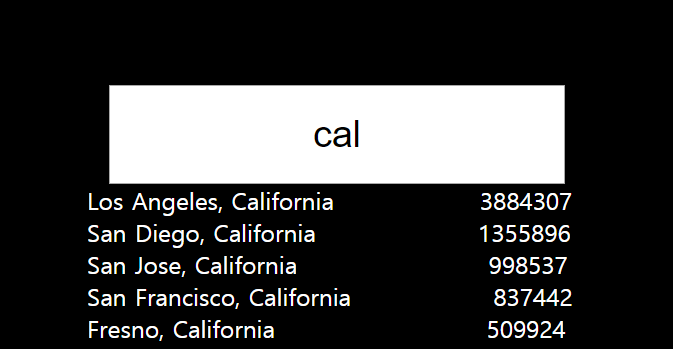
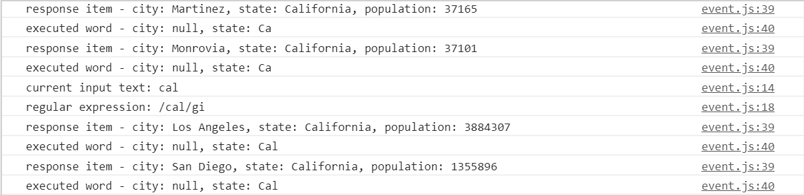

# javascript30-ajaxTypeAhead
ajax type ahead(Vanilla javascript coding challenge day1)

## Getting Started
This is a simple searching tool based on keyword finding via R.E.(Regular Expression)

## Running the tests
No installation. Just fork this repository and pull it to your local enviroment, run index.html on internet browser(in my case, Chrome).

### Break down into end to end tests
Type words of city or state into the input box(City or State) of browser what you want to find. Then, you can see corresponding result city or state includes population. Whenever the words of the box changed, searching algorithm will be genereted and will show you up to date result.

  

### And coding style tests

Needs to add color changing of excuted words which are exec method result of R.E.
Needs to devide search result 
 box into 
 and 
 to stand population result in a line.

  

Can make 'keydown' event handler more simple via 'keyup'. See remarks in 'event.js' file.
More fine regular expression required.

## Built With
No frameworks x No compilers x No libraries x No boilerplate. Vanilla JavaScript!
xhttp AJAX request to provided server.

## Authors
Gi-baek lee, first commit, No contribution. [More about me, LinkedIn](https://www.linkedin.com/in/kibaeklee)

## License
- Course Name: Javascript 30
- Course Instructor: Wes Bros
- Course Web site: [JavaScript30](https://javascript30.com/)
